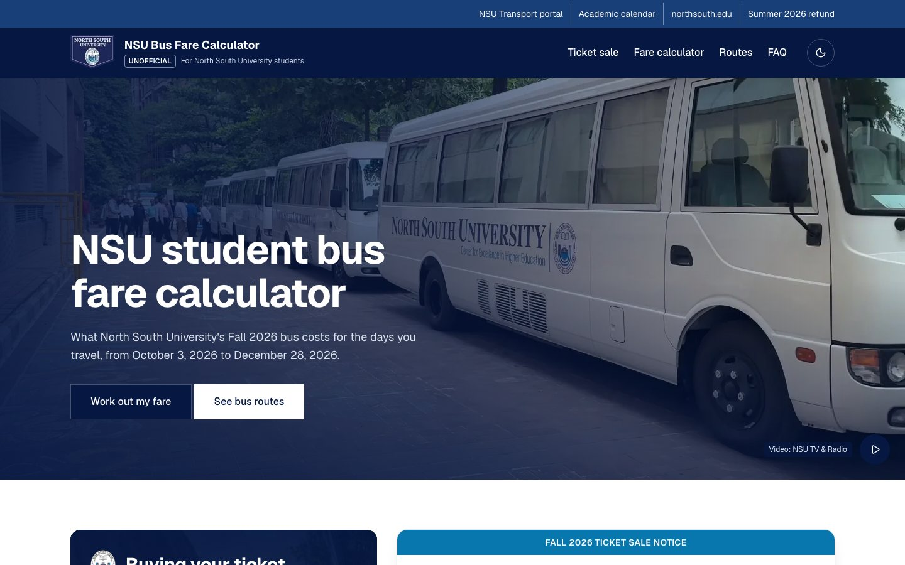
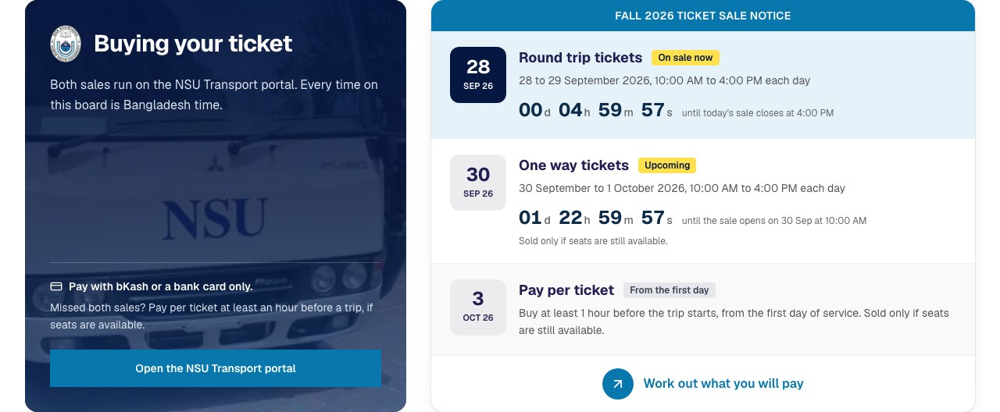
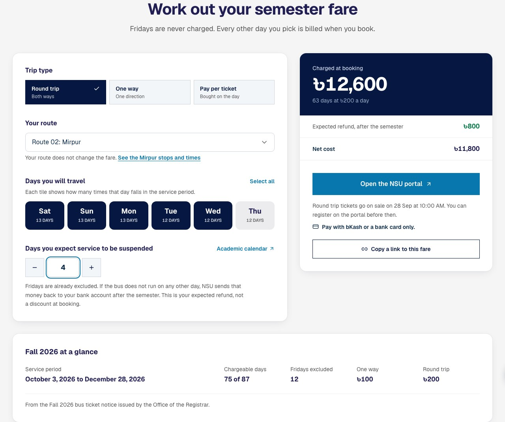
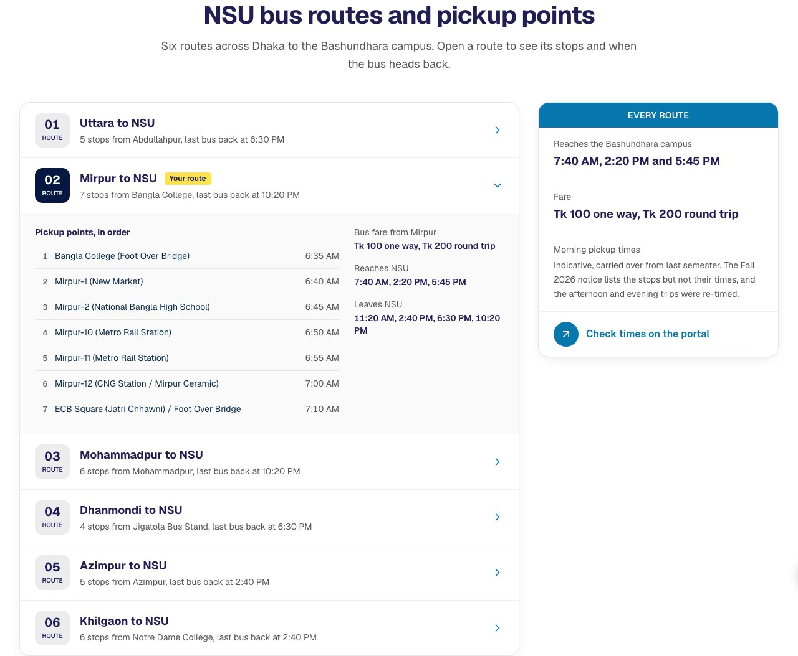
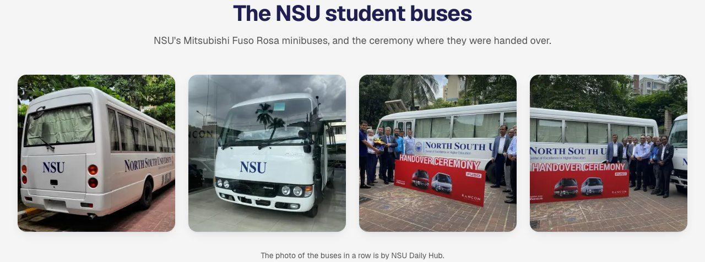
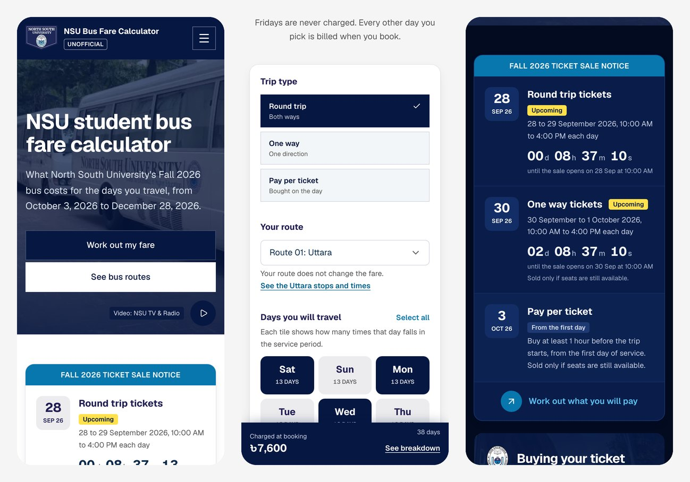

# NSU Bus Fare Calculator

[](https://github.com/tahsinulmohsin/nsu-bus-fare-calculator/releases)
[](https://nsu-bus.tahsinulmohsin.me)
[](https://nsu-bus.tahsinulmohsin.me)
[](https://nextjs.org/)
[](LICENSE)

Work out what the North South University (NSU) student bus costs you for the
**Fall 2026** semester, see every pickup point and trip time on all six Dhaka
routes, and know when tickets go on sale.

**Live:** <https://nsu-bus.tahsinulmohsin.me>

All figures come from the official notice, *Sale of NSU Students' Bus Ticket,
Fall 2026*, issued by the Office of the Registrar. This is an unofficial tool;
always confirm on the [NSU Transport portal](https://transport.northsouth.edu/).



## Contents

- [Screenshots](#screenshots)
- [Features](#features)
- [How the fare is worked out](#how-the-fare-is-worked-out)
- [Fall 2026 at a glance](#fall-2026-at-a-glance)
- [Getting started](#getting-started)
- [Project structure](#project-structure)
- [Updating for a new semester](#updating-for-a-new-semester)
- [Search engine setup](#search-engine-setup)
- [Deployment](#deployment)
- [Versions and releases](#versions-and-releases)
- [Media and credits](#media-and-credits)
- [License](#license)

## Screenshots

The page follows the look of [northsouth.edu](https://www.northsouth.edu/):
a navy header, grey bands with centred titles, notice rows led by date tiles,
and a cyan footer panel. It works in light and dark themes.

**Ticket sale notice board.** Each date tile and yellow tag follows the live
countdown. The tile turns navy while a sale is open.



**Fare calculator.** Pick the trip type, route, days and expected suspended
days. The card on the right shows what you are charged at booking and what
comes back.



**Routes and stops.** Every route opens to show its pickup points, the trips
back from campus and the fare. The route you picked is marked.



**The buses.** Photos of NSU's Mitsubishi Fuso Rosa minibuses and their
handover ceremony.



**On a phone**, in light and dark: the hero, the calculator with the running
fare bar, and the notice board.



## Features

- **Fare calculator** for round trip, one way and pay per ticket. It shows how
  many times each weekday falls in the semester, what you are charged at
  booking, and what comes back if the bus does not run on some days.
- **A ticket sale notice board** with live countdowns for the round trip and
  one way sales. Each row knows whether its sale has not opened, is open, is
  paused overnight or has closed, and its date tile and tag change with it.
  Once both sales end the board shrinks to a single notice.
- **Booking guidance that follows the sale.** The note under the booking
  button says when your trip type goes on sale, how long is left, or that it
  has closed, with a one-tap switch to pay per ticket.
- **All six routes** (Uttara, Mirpur, Mohammadpur, Dhanmondi, Azimpur,
  Khilgaon) with every stop in order, morning pickup times, the trips back from
  campus and the fare. The route you pick in the calculator opens itself.
- **Shareable fares.** Your trip, route, days and suspended days live in the
  URL, so "Copy a link to this fare" sends someone exactly what you worked out.
- **Built for phones.** A running total follows you while you pick days. The
  hero plays three clips of the buses, each cut for phones. Nothing downloads
  until the hero is on screen, the next clip loads only near the end of the
  one playing, and the footage stays still with reduced motion or data saver
  on.
- **Photos of the buses**, from the fleet to their handover ceremony.
- **A plain-language guide and FAQ** on fares, payment, sale dates, timings and
  refunds.
- **Accessible in both themes.** Light and dark mode share one set of colour
  tokens, and every state passes axe-core WCAG 2.2 AA checks.

The visual system, modelled on northsouth.edu, is documented in
[DESIGN.md](DESIGN.md). The site shows the North South University logo at the
owner's request, always next to an "Unofficial" tag.

## How the fare is worked out

NSU charges **Tk 100 per direction, per day**, on every route, and never
charges for Fridays. Booking for the semester means paying up front for every
other day you pick.

If the bus does not run on a day other than Friday, that day is **not**
deducted at booking. NSU refunds it to your bank account after the semester.
The calculator follows that rule: expected suspensions show as money coming
back, not as a discount, so the total is what you actually pay.

Tickets are paid with **bKash or a bank card only**. Refunds are paid to a
bank account only, even if you paid for the ticket with bKash.

## Fall 2026 at a glance

| | |
|---|---|
| Service period | 3 October to 28 December 2026 (last day of final exams) |
| Total days | 87 |
| Fridays excluded | 12 |
| Chargeable days | 75 |
| One way | Tk 100 a day |
| Round trip | Tk 200 a day |

### Ticket sale windows (Bangladesh time)

| Trip type | When |
|---|---|
| Round trip | 28 to 29 September 2026, 10:00 AM to 4:00 PM each day |
| One way | 30 September to 1 October 2026, 10:00 AM to 4:00 PM each day, if seats remain |
| Pay per ticket | At least 1 hour before the trip, if seats remain |

The notice gives each window as a date range with 10:00 AM to 4:00 PM hours.
The app reads that as those hours on each day, so a countdown runs to the
opening, then to that day's close, then to the next morning's reopening.

### Timings

Every route reaches NSU at **7:40 AM, 2:20 PM and 5:45 PM**. Trips back differ
by route:

| Leaves NSU | Routes |
|---|---|
| 11:20 AM | All |
| 2:40 PM | All |
| 6:30 PM | Uttara, Mirpur, Mohammadpur, Dhanmondi |
| 10:20 PM | Mirpur, Mohammadpur |

The notice lists the stops but not their pickup times, and it re-timed the
afternoon and evening trips. The app shows morning pickup times carried over
from Summer 2026, labelled as indicative, since the 7:40 AM arrival and the
stop lists are unchanged.

## Getting started

Requires **Node.js 20.9 or later**.

```bash
git clone https://github.com/tahsinulmohsin/nsu-bus-fare-calculator.git
cd nsu-bus-fare-calculator
npm install
npm run dev
```

Then open <http://localhost:3000>.

| Script | What it does |
|---|---|
| `npm run dev` | Development server with Turbopack |
| `npm run build` | Production build (standalone server output) |
| `npm run start` | Serve the production build |
| `npm run lint` | ESLint with the Next.js and TypeScript rules |
| `npm run typecheck` | TypeScript check without emitting files |

**Stack:** [Next.js 16](https://nextjs.org/) (App Router),
[React 19](https://react.dev/), [Tailwind CSS v4](https://tailwindcss.com/),
[Geist](https://vercel.com/font), [Lucide](https://lucide.dev/) icons and
[next-themes](https://github.com/pacocoursey/next-themes). Animation runs in
CSS, so there is no animation library in the bundle.

## Project structure

```
app/
  page.tsx                  Home page, structured data (JSON-LD)
  layout.tsx                Fonts, metadata, Open Graph and Twitter cards
  robots.ts, sitemap.ts,    /robots.txt, /sitemap.xml, /manifest.webmanifest
  manifest.ts
  globals.css               Colour tokens for both themes, motion
  components/
    BusFareCalculator.tsx   The page: hero, calculator, phone fare bar
    SiteHeader.tsx          Utility bar, main bar with logo, phone menu, theme toggle
    SiteFooter.tsx          Photo footer with the link panel (server rendered)
    TicketSaleCountdowns.tsx  Ticket sale notice board with live countdowns
    RouteSchedule.tsx       All six routes with stops and trips back
    AboutBusService.tsx     "How the NSU student bus works" and bus photo (server rendered)
    Faq.tsx                 FAQ (server rendered)
    RefundNotice.tsx        Summer 2026 refund note
    HeroVideo.tsx           Background video with data and motion checks
    BusGallery.tsx          Photos of the buses (server rendered)
    ScrollTopButton.tsx     Back-to-top button on desktop
    ui.tsx                  Section titles, date tiles, tags, notice bars, arrow links
  lib/
    semester.ts             Semester dates, fares, sale windows, refund data
    routes.ts               Routes, stops, arrivals and departures
    seo.ts                  Site URL, title, description and FAQ content
    useFareParams.ts        Calculator state kept in the URL
    useNow.ts, useClient.ts Clock, hydration and motion-preference stores
app/assets/                 Hero still, card frame, bus and gallery photos, NSU logo and seal
public/video/               The three hero clips, each cut for phones and wider screens
Dockerfile, docker-compose.yml  Self-hosting
DESIGN.md                   Visual design system
CHANGELOG.md                Every version and what changed
```

## Updating for a new semester

Almost everything lives in **`app/lib/semester.ts`**. The day counts are
worked out from the dates, so the header, the summary and the weekday counts
can never disagree.

1. Set `SEMESTER_LABEL`, `SEMESTER_START`, `SEMESTER_END` and the two `Date`
   objects from the academic calendar.
2. Set `TICKET_SALES` from the transport notice: one entry per trip type, with
   one `sessions` entry per selling day. The countdowns and booking notes read
   from it.
3. Set `NOTICE_PUBLISHED` to `false` while working from estimated figures. That
   shows a banner saying so; set it back to `true` once the notice is out.
4. Update `REFUND` when a refund notice is issued, and the routes and times in
   `app/lib/routes.ts`.

The FAQ, the guide and the structured data are all built from these files, so
they update with them.

## Search engine setup

- Title, description, canonical URL and robots directives are set in
  `app/layout.tsx` from `app/lib/seo.ts`.
- `/robots.txt`, `/sitemap.xml` and `/manifest.webmanifest` are generated by
  `app/robots.ts`, `app/sitemap.ts` and `app/manifest.ts`.
- `app/page.tsx` puts one JSON-LD graph in the server HTML: the website, North
  South University, the calculator as a free web application, and the FAQ.
  The FAQ on the page and in the JSON-LD come from the same list.
- Every route's stops and fare are in the HTML even when collapsed, so
  searches such as "Uttara to NSU bus" can match.

Google retired FAQ rich results on 7 May 2026, so the FAQ markup does not
produce FAQ snippets. The visible FAQ text is what helps.

## Deployment

### Production (Vercel)

- **Address:** <https://nsu-bus.tahsinulmohsin.me>
- The project is connected to Vercel through GitHub. Every push to `master`
  builds and deploys to production, and Vercel records each one under this
  repository's **Deployments** (the *Production* environment).
- The original address, <https://nsu-bus-fare-calculator.vercel.app>, redirects
  permanently (301) to the subdomain, keeping the path and query. The rule is
  in `next.config.ts` and matches that host only, so preview deployments are
  not redirected.
- The page regenerates at most hourly (incremental static regeneration), so the
  ticket sale countdowns always ship in the right state.
- [Vercel Web Analytics](https://vercel.com/docs/analytics) counts page views
  without cookies. It is only rendered when the build runs on Vercel, so the
  Docker build carries no analytics.
- The `production` git tag marks the commit that is live. See
  [Versions and releases](#versions-and-releases).

### Self-hosting (Docker)

The app builds as a standalone Node server, so it runs anywhere Docker does:

```bash
docker compose up -d --build
```

That serves it on port 3000 as a non-root user, with a health check. Pages
regenerate hourly inside the container as they do on Vercel. The canonical URL,
sitemap and structured data keep pointing at nsu-bus.tahsinulmohsin.me, so
search engines treat that as the one real page. To make another address the
canonical one, build with
`--build-arg NEXT_PUBLIC_SITE_URL=https://your.domain`.

To regenerate the hero videos, see [Media and credits](#media-and-credits).

## Versions and releases

The project follows [Semantic Versioning](https://semver.org/):

- **Major** (`3.0.0`): a new semester's data model or a redesign that changes
  how the app is used.
- **Minor** (`2.5.0`): new features, or a newly published notice.
- **Patch** (`2.4.2`): fixes and documentation.

Each version has a `package.json` version, an entry in
[CHANGELOG.md](CHANGELOG.md), an annotated git tag (`vX.Y.Z`) and a
[GitHub release](https://github.com/tahsinulmohsin/nsu-bus-fare-calculator/releases).

The `production` tag always points at the commit serving
nsu-bus.tahsinulmohsin.me. It moves once a new deploy is verified.

To cut a release:

```bash
# 1. Bump "version" in package.json and add a CHANGELOG.md entry, then commit.
git tag -a v2.5.0 -m "v2.5.0 - short summary"
git push origin master v2.5.0

# 2. Once Vercel shows the deploy as Ready and the site checks out:
git tag -fa production -m "Production: v2.5.0"
git push -f origin production

# 3. Publish the release notes from the changelog entry.
gh release create v2.5.0 --title "v2.5.0" --notes-file notes.md
```

## Media and credits

None of the media below is covered by the MIT license. Every file is listed
with where it came from and how it was made.

| File | Source | How it was made |
| --- | --- | --- |
| `public/video/warming-up.mp4`, `warming-up-mobile.mp4` | "NSU bus is warming up before carrying our CGPA struggles", a YouTube Short by NSU Daily Hub (`_AkmkB1o-nA`) | Bottom 200 px with the channel mark cropped off. Phone cut: the whole portrait frame at 480 px wide. Desktop cut: the centre 1080×576 band |
| `public/video/bus-service.mp4`, `bus-service-mobile.mp4` | "NSU bus service", a YouTube Short by The Daily NSU, filmed by Rafiur Rahim Rafi (`ZkyqGpvHJyM`) | Top 110 px and bottom 140 px with the channel mark and signature cropped off. Phone cut: 480 px wide. Desktop cut: the centre 720×384 band |
| `public/video/ac-bus.mp4`, `ac-bus-mobile.mp4` | "Big News! NSU is launching AC bus service for students", NSU TV & Radio (`-TNg9uyT6rA`) | Top 184 px with the channel mark cropped off, then scaled to 1152 px and 640 px wide |
| `app/assets/hero-poster.webp` | Frame at 6 s of the AC bus video | Same crop, 1920 px wide. next/image serves it at the size each screen needs |
| `app/assets/campus-bus.webp` | Owner-supplied photo of NSU bus 2 beside a campus building (original source not recorded) | 1920 px wide, used as the footer backdrop |
| `app/assets/gallery-fleet.webp` | Photo of the buses in a row by NSU Daily Hub, supplied by the owner | Square crop that leaves out the NSU Daily Hub mark (credited under the gallery instead), 1000 px |
| `app/assets/gallery-showroom.webp` | Owner-supplied photo of an NSU bus in a showroom (original source not recorded) | Square crop, 1000 px |
| `app/assets/gallery-handover-1.webp`, `gallery-handover-2.webp` | Owner-supplied photos of the Mitsubishi Fuso Rosa handover ceremony (original source not recorded) | Square crops inside the original white frame, 1000 px |
| `app/assets/ticket-bus.webp` | Frame at 12 s of the AC bus video | Same crop, 1200 px wide |
| `app/assets/nsu-student-bus.jpg` | Third-party photo of an NSU minibus, supplied by the owner | As supplied, 480×640 |
| `app/assets/nsu-logo.png`, `nsu-seal.png` | North South University's logo and seal, from northsouth.edu | As published, used at the owner's request |

The channel marks are cropped out to keep the footage clean, so the hero
credits the clip that is playing in its bottom corner. Videos are silent
H.264, two-pass encoded (about 500 kbps for wide screens and 120 to 200 kbps
for phones) with `-movflags +faststart`. For example, the AC bus clip:

```bash
ffmpeg -i source.mkv -an -vf "crop=1920:896:0:184,scale=1152:-2" -c:v libx264 -preset slow -b:v 500k -pass 1 -f mp4 /dev/null
ffmpeg -i source.mkv -an -vf "crop=1920:896:0:184,scale=1152:-2" -c:v libx264 -preset slow -b:v 500k -pass 2 -pix_fmt yuv420p -movflags +faststart public/video/ac-bus.mp4
```

## License

The source code is released under the [MIT License](LICENSE). You are free to
use, change and share it, including commercially, as long as the copyright and
license notice stay with it.

The license covers the code only. The videos and images listed under
[Media and credits](#media-and-credits), the North South University name, logo
and seal, and the route and fare data from its notices belong to their
respective owners. None of these are licensed here.

---

*Unofficial tool, not affiliated with North South University. Always confirm
routes, timings and fares on the
[NSU Transport portal](https://transport.northsouth.edu/).*
